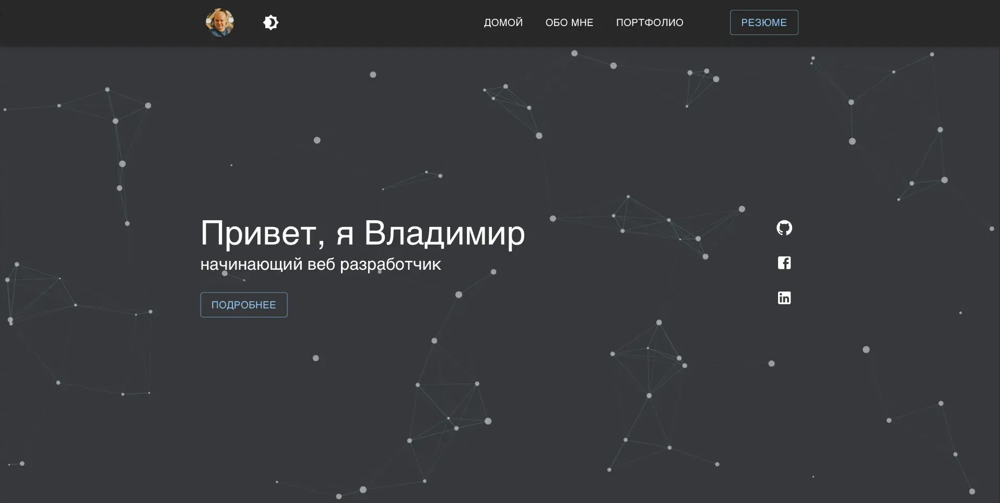

# Мое портфолио

### Описание
Одностраничное приложение является сайтом портфолио с возможностью пополнения контента без вмешательства в верстку.
#### Демонстрация приложения: [https://pestov-web.ru](https://pestov-web.ru)
### Стек приложения

## Работа с приложением

### в директории приложения можно использовать команды:

#### установка необходимых пакетов для работы
#### `npm i`

#### запуск приложения в режиме разработки, необходимо перейти по ссылке  [http://localhost:3000](http://localhost:3000) для просмотра
#### `npm run start`

#### Собирает приложения для размещения в папку `build`.
#### `npm run build`

